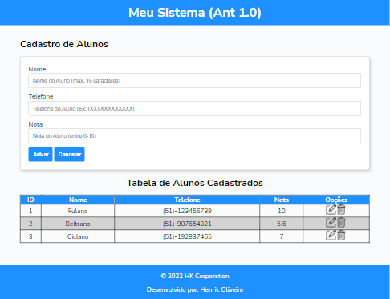

# CadastroAlunos-js
 

# Sobre o Projeto

CadastroAlunos-js é uma aplicação web construída para o processo seletivo da <a href="https://www.maisprati.com.br">+prati</a> 
em parceria com a <a href="http://www.alfamidia.com.br">AlfaMidia</a>.

A aplicação consite em um sistema de cadastro de Alunos, onde pode ser realizado algumas manipulações com os dados cadastrados.

# Layout do Sistema

  

# Tecnologias utilizadas

* HTML
* CSS
* JavaScript

# Autor

Henrik Oliveira

https://www.linkedin.com/in/henrik-oliveira
